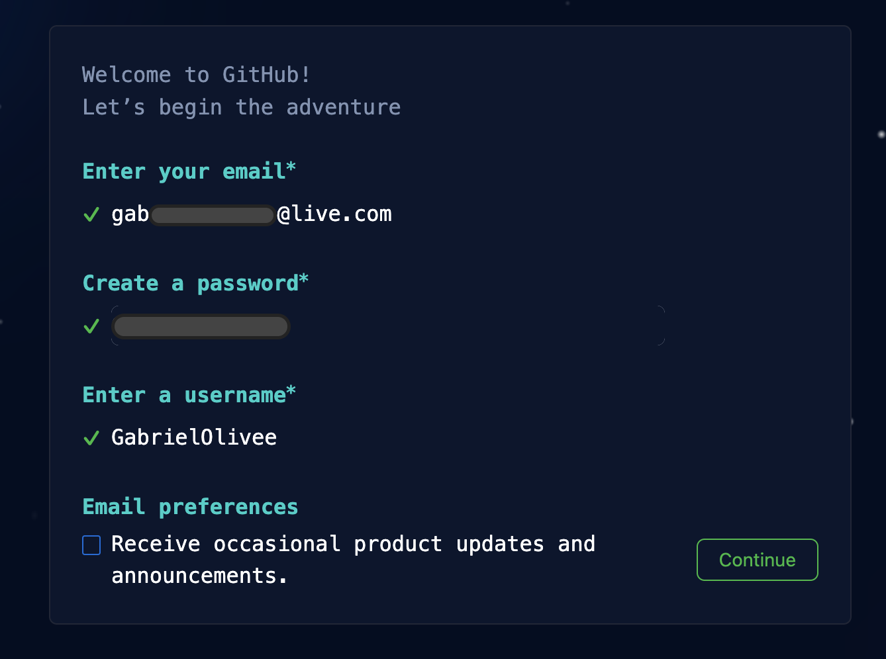

# Git e GitHub

## Git

Git é um sistema de controle de versão distribuído amplamente utilizado no desenvolvimento de software. Ele foi criado por Linus Torvalds em 2005 para ajudar no desenvolvimento do kernel do Linux. O Git permite que os desenvolvedores trabalhem em projetos de forma colaborativa e acompanhem as alterações feitas no código-fonte ao longo do tempo.

### Principais recursos do Git:

- **Controle de Versão**: Permite rastrear alterações em arquivos ao longo do tempo, possibilitando a recuperação de versões anteriores.
  
- **Branching e Merging**: Permite que os desenvolvedores criem ramificações (branches) independentes do código para trabalhar em novas funcionalidades ou correções de bugs, e depois integrem essas alterações de volta ao código principal (merge).

- **Distribuído**: Cada cópia do repositório Git contém todo o histórico de revisões, o que significa que os desenvolvedores podem trabalhar offline e colaborar com outros sem depender de uma conexão centralizada.

### GitFlow

GitFlow é um modelo de fluxo de trabalho para Git que define uma estrutura para o desenvolvimento de software com Git. Ele consiste em uma série de regras e convenções para gerenciar ramificações (branches) e releases de forma organizada.

## GitHub

GitHub é uma plataforma de hospedagem de código-fonte baseada na web que utiliza o Git para controle de versão. Ele fornece uma série de recursos adicionais para tornar o desenvolvimento colaborativo mais eficiente e organizado.

### Principais recursos do GitHub:

- **Repositórios**: Permitem que os desenvolvedores hospedem e compartilhem seus projetos de software. Cada repositório no GitHub é um local onde o código-fonte é armazenado, gerenciado e compartilhado.

- **Colaboração**: O GitHub facilita a colaboração entre desenvolvedores, permitindo que vários contribuintes trabalhem em um projeto simultaneamente, gerenciem problemas (issues) e discutam alterações em pull requests.

- **Integração Contínua**: O GitHub Actions permite a automação de fluxos de trabalho, como testes de unidade, integração contínua e implantação automatizada, para garantir a qualidade do código e simplificar o processo de entrega.

### Criar e Configurar o GitHub

- Para criar e configurar uma conta no GitHub, visite o site oficial do GitHub em [github.com](https://github.com/) e siga as instruções para criar uma conta gratuita.
    - No canto superior direito clique em SIGN UP
    - 
      
      
    - Preencha as informações de nome, e-mail, nome de usuário e senha.
    - 
      
      
    - Resolva o problema para comprovar que não é um robô
    - 
      
      
    - Escolha a versão que você irá utilizar, como Empresarial, ou pessoal e qual a intenção de uso( no meu caso eu infomei que era pra estudo e compartilhar códigos).
    - Pronto sua conta está criada e esta e a sua Janela inicial.
    - 
      
    
- Depois de criar sua conta, você pode configurar seu perfil, adicionar sua foto, definir suas preferências de notificação e muito mais nas configurações do GitHub.

## Instalar e Configurar o Git

- Para instalar o Git em seu sistema, visite o site oficial do Git em [git-scm.com](https://git-scm.com/) e siga as instruções de instalação para o seu sistema operacional.
  
- Após a instalação, você pode configurar o Git com seu nome de usuário e endereço de e-mail usando o comando `git config`.

## Criar um Repositório, Adicionar Arquivos, Fazer Comentários, Fazer Commit, Empurrar as Alterações, Criar Branch, Reverter Alterações e Consultar o Histórico de Mudanças

- **Criar um Repositório**: Use o comando `git init` para criar um novo repositório Git ou clone um repositório existente do GitHub usando `git clone`.
  
- **Adicionar Arquivos**: Adicione arquivos ao repositório usando `git add`.

- **Fazer Comentários e Commit**: Comente suas alterações usando `git commit` para criar uma nova revisão no repositório.

- **Empurrar as Alterações**: Envie suas alterações para o repositório remoto no GitHub usando `git push`.

- **Criar Branch**: Crie uma nova ramificação (branch) para trabalhar em uma funcionalidade específica usando `git branch` e `git checkout`.

- **Reverter Alterações**: Reverta as alterações no código usando `git revert` ou `git reset`.

- **Consultar o Histórico de Mudanças**: Visualize o histórico de alterações no repositório usando `git log`.

Em resumo, Git é um sistema de controle de versão distribuído que permite rastrear e gerenciar alterações no código-fonte, enquanto o GitHub é uma plataforma que utiliza o Git para hospedar projetos de software e facilitar a colaboração entre desenvolvedores.
